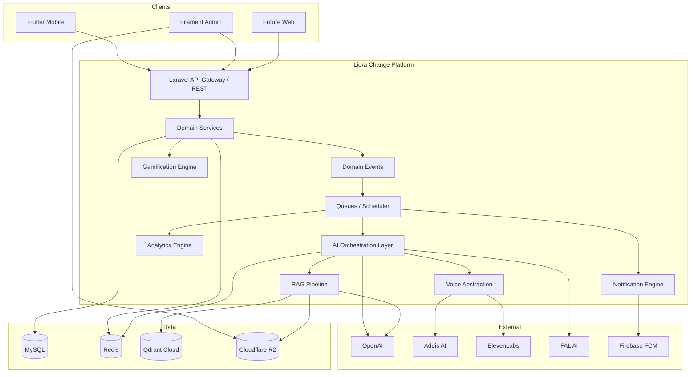
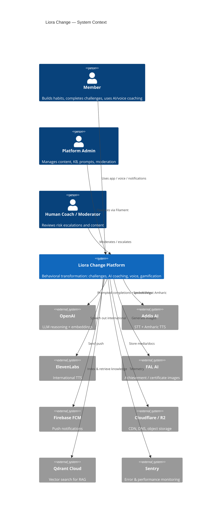
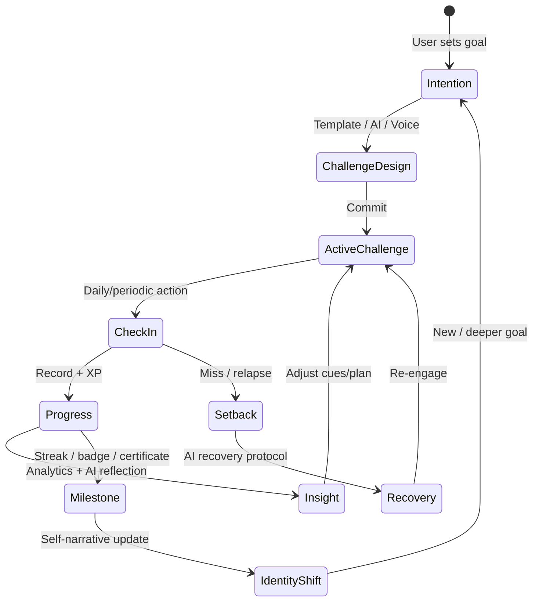
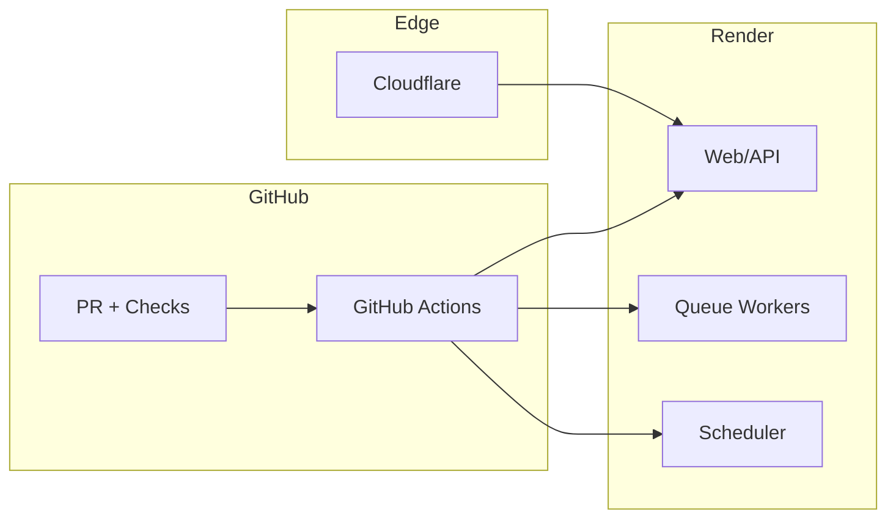
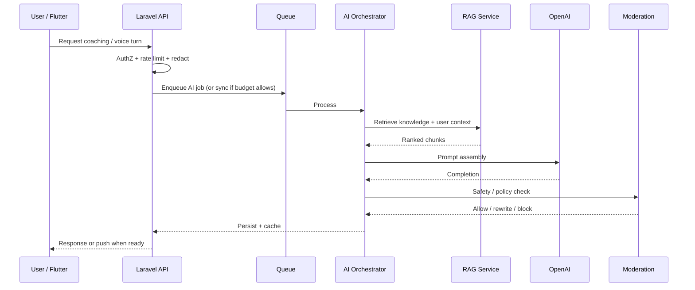

# Chapter 01 — Executive Summary

**Document ID:** LC-ARCH-01  
**Version:** 1.0  
**Status:** Approved for engineering guidance  
**Owner:** CTO / Principal Architect  
**Last Updated:** 2026-07-25  
**Depends On:** None (foundation chapter)  
**Feeds Into:** Chapters 02–50  

---

## 1. Business Context

### 1.1 What Liora Change Is

**Liora Change** is an AI-powered behavioral transformation platform. It is **not** a habit tracker. Habit trackers record completion. Liora Change engineers behavior change: intention → action → identity → sustained consistency, with recovery support when people fail.

The product unifies:

| Pillar | Role |
|--------|------|
| Behavioral science | Challenge structure, cue–routine–reward design, Tiny Habits / Atomic Habits / CBT-aligned patterns |
| Accountability | Structured challenges, check-ins, streaks with humane recovery |
| Gamification | XP, levels, badges, rewards — motivation without shame loops |
| AI coaching | Personalized guidance, risk prediction, reflection analysis, multilingual support |
| Voice | Hands-free challenge creation, check-ins, coaching, and reminders |
| Analytics | Long-term growth insight for users and operators |
| Admin governance | Content, knowledge, prompts, moderation, feature flags |

### 1.2 Mission

Help people transform intentions into sustainable habits using behavioral science, structured challenges, accountability, gamification, recovery support, artificial intelligence, and voice interaction.

### 1.3 Strategic Positioning

| Dimension | Habit Tracker | Liora Change |
|-----------|---------------|--------------|
| Core unit | Checkbox | Challenge + behavioral cycle |
| Failure model | Streak break / guilt | Recovery protocols + AI encouragement |
| Personalization | Rules / templates | RAG + user history + risk models |
| Interface | Forms | Forms + voice + AI conversation |
| Horizon | Daily logging | Identity and multi-month transformation |
| Moat | UX | Behavioral knowledge + AI memory + multilingual voice (incl. Amharic) |

### 1.4 Target Platforms (Near-Term)

1. **Flutter mobile** — primary consumer surface  
2. **Laravel REST API** — system of record and orchestration  
3. **Filament v4 admin** — operators, coaches, content, AI governance  
4. **Future web platform** — secondary consumer / marketing / companion experiences  

### 1.5 Scale Ambition

The architecture must support evolution from early traction to **millions of users** without rewrite: modular bounded contexts, async AI pipelines, horizontal workers, managed vector search, and strict API versioning.

---

## 2. Technical Design

### 2.1 Platform Shape (Summary)

```text
Flutter App  ──REST/Sanctum──►  Laravel API  ──►  MySQL (system of record)
      │                              │
      │                              ├── Redis (cache, queues, rate limits, locks)
      │                              ├── Queue Workers (AI, notifications, embeddings)
      │                              ├── Scheduler (reminders, digests, risk jobs)
      │                              ├── Filament Admin
      │                              ├── OpenAI (reasoning + embeddings)
      │                              ├── Vector DB (RAG)
      │                              ├── Addis AI / ElevenLabs (voice)
      │                              ├── FAL AI (images/certificates)
      │                              ├── Cloudflare R2 (media/docs)
      │                              ├── FCM (push)
      │                              └── Sentry + Render metrics
```

### 2.2 Core Product Capabilities (Architecture View)

| Capability Cluster | Examples | Primary Runtime |
|--------------------|----------|-----------------|
| Identity & Access | Register, login, devices, roles | Sync API |
| Challenges | Create, templates, lifecycle, categories | Sync API + events |
| Progress & Recovery | Check-ins, streaks, relapse recovery | Sync API + scheduled risk |
| Gamification | XP, levels, badges, rewards | Domain services + events |
| AI Coaching | Coach, motivation, reflection, recommendations | Async queues + RAG |
| Voice Assistant | STT → reason → TTS | Async + streaming-ready contracts |
| Notifications | AI-personalized push/in-app | Scheduler + queue + FCM |
| Knowledge / RAG | Ingest, embed, retrieve, version | Admin + workers |
| Analytics | User growth, consistency, risk | Aggregations + warehouse-ready events |
| Admin / Governance | Prompts, KB, moderation, flags | Filament |

### 2.3 Guiding Technical Principles

1. **Domain first** — bounded contexts own language and invariants; controllers stay thin.  
2. **API as contract** — Flutter and future web share versioned REST contracts.  
3. **AI as a subsystem** — providers behind ports/adapters; business rules never hardcode vendor SDKs.  
4. **Async by default for AI** — user-facing latency budgets force queue/stream patterns for long generations.  
5. **Human override** — admin moderation, prompt versioning, kill switches, and fallbacks.  
6. **Privacy by design** — behavioral and reflection data are sensitive; minimize retention and scope embeddings carefully.  
7. **Observability from day one** — Sentry, health checks, AI cost/latency/quality metrics.  
8. **Evolve, don’t rewrite** — feature flags, API versioning, provider abstraction, schema migrations.  

### 2.4 Recommended Vector Database Decision (Executive)

**Decision:** Use **Qdrant Cloud** as the managed vector database for RAG.

| Option | Verdict | Rationale |
|--------|---------|-----------|
| **Qdrant Cloud** | **Selected** | Strong hybrid search (dense + payload filters), excellent metadata filtering for user/tenant/locale, predictable pricing, REST/gRPC friendly from Laravel workers on Render, open-source escape hatch |
| Pinecone | Strong alternate | Excellent managed UX; less flexible payload filtering model for complex behavioral metadata; vendor lock-in higher |
| Weaviate Cloud | Viable | Rich hybrid/search modules; heavier operational/conceptual surface for early team |

Full ADR rationale appears in Chapter 25 (RAG Architecture). This chapter locks the strategic choice so downstream chapters stay consistent.

### 2.5 High-Level Capability Map



---

## 3. Architecture Decisions

| ADR ID | Decision | Summary |
|--------|----------|---------|
| ADR-001 | Modular monolith first | Ship a Laravel modular monolith with clear bounded contexts; extract services only when scale or team boundaries demand it |
| ADR-002 | Flutter as primary client | Mobile-first UX; API-first so web can follow without domain rewrites |
| ADR-003 | Sanctum token auth | API token auth for mobile; admin session auth via Filament |
| ADR-004 | MySQL system of record | Relational consistency for challenges, progress, gamification, billing-ready entities |
| ADR-005 | Redis for ephemeral state | Cache, queues, locks, rate limits, short-lived AI response cache |
| ADR-006 | Qdrant Cloud for vectors | Managed hybrid retrieval compatible with Render workers |
| ADR-007 | Provider ports for AI/voice | OpenAI / Addis / ElevenLabs / FAL behind interfaces |
| ADR-008 | Event + queue backbone | Domain events drive XP, notifications, embeddings, analytics |
| ADR-009 | Filament as control plane | Operators manage KB, prompts, flags, moderation without code deploys |
| ADR-010 | API versioning `/api/v1` | Explicit version path; additive changes preferred; breaking changes require `v2` |
| ADR-011 | Render + Docker + GHA | Deploy API, workers, scheduler as separate process types |
| ADR-012 | AI governance mandatory | Prompt versions, evals, cost caps, PII redaction, human escalation paths |

These ADRs are ratified at executive level; later chapters expand mechanics without contradicting them unless a formal ADR supersedes them.

---

## 4. Mermaid Diagrams

### 4.1 System Context (C4 Level 1 Preview)



### 4.2 Transformation Loop (Product Architecture)



### 4.3 Delivery Topology (Executive)



---

## 5. API Implications

### 5.1 Contract Philosophy

- All mobile and future web clients consume **versioned REST** under `/api/v{n}`.
- Responses use consistent resource envelopes, pagination, and error shapes (Chapter 21).
- AI endpoints distinguish **sync short answers** vs **async jobs** (`202 Accepted` + job status polling or websocket/broadcast later).
- Voice endpoints accept audio upload or streaming session IDs; never embed provider-specific payloads in public contracts.

### 5.2 Feature Surface Groups (Preview)

| Group | Example Resources | Auth |
|-------|-------------------|------|
| Auth | `/auth/register`, `/auth/login`, `/auth/logout` | Public / token |
| Profile | `/me`, preferences, locale, timezone | Bearer |
| Challenges | `/challenges`, templates, categories | Bearer |
| Progress | `/check-ins`, streaks, recovery | Bearer |
| Gamification | `/xp`, `/badges`, `/rewards`, `/levels` | Bearer |
| AI | `/ai/coach`, `/ai/reflections`, `/ai/recommendations` | Bearer + rate limits |
| Voice | `/voice/sessions`, `/voice/utterances` | Bearer + media limits |
| Notifications | `/notifications`, preferences | Bearer |
| Analytics | `/analytics/me`, summaries | Bearer |
| Admin | Filament + internal admin APIs | Role-gated |

Detailed schemas are deferred to Chapters 18–21 and per-feature specs; this chapter freezes the grouping and versioning approach.

### 5.3 Cross-Cutting API Rules (Executive)

- Idempotency keys for check-ins and AI job creation.
- Per-user and per-IP rate limits; stricter for AI and voice.
- Localization via `Accept-Language` + user preference.
- Soft deletes never leak deleted resources in default listings.

---

## 6. Database Implications

### 6.1 System of Record

MySQL holds authoritative state for users, challenges, progress, gamification, notifications metadata, prompt versions, KB document registry, audit logs, and feature flags.

### 6.2 Complementary Stores

| Store | Holds | Does Not Hold |
|-------|-------|---------------|
| Redis | Cache, queues, locks, ephemeral AI cache | Source of truth for progress |
| Qdrant | Embeddings + retrieval payloads | Canonical user profile / billing |
| R2 | Media, uploaded KB documents, generated certificates | Relational relationships |

### 6.3 Growth Considerations (Executive)

- Partition-ready tables for high-volume check-ins, AI interaction logs, and notification deliveries.
- Append-only event/outbox tables for reliable async processing.
- Soft deletes + audit columns (`created_at`, `updated_at`, `deleted_at`, `created_by`, `updated_by` where relevant).
- Separate **PII-minimized** analytics projections from operational tables where feasible.

Full ERD and table specs: Chapters 15–17.

---

## 7. AI Implications

### 7.1 AI Product Surface

| Feature | Business Outcome |
|---------|------------------|
| Challenge Assistant | Faster, better-formed challenges |
| Habit / Behavioral Coach | Context-aware guidance |
| Motivation Generator | Personalized daily drive |
| Reflection Analyzer | Insight from journal/voice reflections |
| Progress Analyzer | Pattern detection across time |
| Recommendation Engine | Next-best challenge / habit |
| Risk Prediction | Early relapse / dropout intervention |
| Voice Assistant | Low-friction interaction |
| Conversation Memory | Continuity across sessions |
| Personalized Notifications | Right message, right time, right language |
| Achievement Image / Certificate | Celebration artifacts |
| Translation / Multilingual | Inclusive global + Amharic-first voice path |

### 7.2 AI Runtime Pattern



### 7.3 Non-Negotiables

- Prompt templates are versioned and admin-managed (Chapter 48).
- RAG sources are versioned and auditable (Chapter 49).
- Cost, latency, and quality are first-class SLOs.
- Fallback copy exists when AI providers fail.
- No medical/clinical diagnosis claims; coaching language is supportive and bounded.

---

## 8. Security Considerations

### 8.1 Threat Summary

| Area | Risk | Executive Control |
|------|------|-------------------|
| Account takeover | Token theft, weak passwords | Sanctum tokens, device binding options, rate limits, secure storage on device |
| Sensitive reflections | Data leakage via logs/RAG | PII redaction, scoped embeddings, encryption in transit, access policies |
| Prompt injection | Malicious user text influencing AI | Input isolation, retrieval allowlists, output moderation |
| Admin abuse | Privilege misuse | RBAC, audit logs, least privilege |
| Media abuse | Malicious uploads | Type/size validation, virus scanning path, signed R2 URLs |
| Supply chain | Dependency / CI compromise | Locked deps, GHA OIDC, least-privilege deploy keys |

### 8.2 Privacy Posture (Preview)

Behavioral data, mood, energy, reflections, and voice audio are **sensitive personal data**. Retention, consent, export, and deletion flows are mandatory (Chapter 38). AI features must respect user locale and consent flags.

### 8.3 Security Baseline

- TLS everywhere (Cloudflare → Render).
- Secrets only in Render env / secret stores — never in git.
- Principle of least privilege for DB, R2, and vector collections.
- Sentry scrubbing rules for tokens and PII.

---

## 9. Risks

| Risk | Impact | Likelihood | Mitigation |
|------|--------|------------|------------|
| AI cost explosion at scale | Margin collapse | Medium | Caching, smaller models for routine tasks, per-user budgets, async batching |
| Hallucinated coaching advice | Trust / safety harm | Medium | RAG grounding, policy prompts, moderation, disclaimers, human escalation |
| Over-gamification / shame loops | Churn, harm | Medium | Recovery-first product rules, streak forgiveness, ethics review |
| Provider lock-in (voice/LLM) | Delivery risk | Medium | Port/adapter interfaces, dual TTS path already planned |
| Monolith complexity growth | Slow delivery | High over time | Strict bounded contexts, module boundaries, extract when justified |
| Multilingual quality gaps | Exclusion of key markets | Medium | Locale eval sets, Amharic voice QA, human review samples |
| Render worker saturation | Latency spikes | Medium | Autoscale workers, queue priority lanes, backpressure |
| Knowledge staleness | Poor RAG answers | Medium | KB versioning, freshness SLAs, admin workflows |
| Incomplete observability | Blind incidents | Medium | Sentry + health + AI metrics from MVP |
| Scope creep across 50 chapters | Delayed MVP | High | Phased roadmap (Chapter 50), kill non-critical AI until core loop works |

---

## 10. Future Scalability

### 10.1 Scale Stages

| Stage | Users | Architecture Posture |
|-------|-------|----------------------|
| 0 — Foundation | Internal / beta | Modular monolith, single MySQL, Redis, 1–2 workers |
| 1 — Growth | 10k–100k | Read replicas optional, queue priority, CDN, AI cache hit-rate focus |
| 2 — Scale | 100k–1M | Shard hot tables or archive check-ins, dedicated AI workers, stronger rate limits |
| 3 — Mass | 1M+ | Consider extracting AI orchestration / notification services; multi-region if required |

### 10.2 Scalability Levers Already Designed In

- Stateless API instances behind Cloudflare.
- Horizontal queue workers by lane (`ai`, `notifications`, `embeddings`, `default`).
- Vector DB managed externally (Qdrant Cloud).
- Object storage external (R2).
- Feature flags for gradual rollout.
- Event-driven fan-out instead of synchronous cascades.

### 10.3 Explicit Non-Goals (Now)

- Multi-region active-active (defer).
- Microservices for every bounded context (defer).
- Real-time multiplayer social graph at MVP (optional later).
- On-device LLM as primary coach (research track only).

---

## 11. Acceptance Criteria

This chapter is accepted when stakeholders agree that:

1. **Positioning is clear:** Liora Change is a behavioral transformation platform, not a habit tracker.  
2. **Stack is locked:** Flutter + Laravel 12 + Filament v4 + MySQL + Redis + Render + listed AI providers.  
3. **Vector DB choice is locked:** Qdrant Cloud for RAG.  
4. **Architecture style is locked:** Modular monolith with provider ports, events, and queues.  
5. **Client strategy is locked:** Mobile-first API contracts; admin via Filament; web later.  
6. **AI is treated as a governed subsystem:** prompts, RAG, moderation, cost, fallbacks.  
7. **Security/privacy are first-class:** sensitive behavioral data controls are mandatory.  
8. **Scale path is defined:** evolution stages without premature microservices.  
9. **Documentation program is authorized:** remaining Chapters 02–50 will expand without contradicting this summary unless an ADR supersedes it.  
10. **No implementation is implied:** this document guides design; it does not authorize shipping code by itself.

---

## 12. Chapter Traceability

| Concern | Next Chapters |
|---------|---------------|
| Vision, goals, personas, journeys | 02–05 |
| Requirements | 06–07 |
| Domain & DDD | 08–09 |
| C4 & feature architecture | 10–14 |
| Data & API | 15–21 |
| Mobile / Backend / AI / Voice / Notifications | 22–27 |
| Gamification / Analytics / Search / Admin | 28–31 |
| Events / Queues / Scheduler / Cache / Redis | 32–36 |
| Security / Privacy / Observability | 37–39 |
| Deploy / Docker / CI/CD / DR / Scale | 40–44 |
| Testing / Release | 45–46 |
| AI Governance / Prompts / KB | 47–49 |
| Roadmap | 50 |

---

## 13. Executive One-Page Summary

**Build** a modular Laravel platform that powers Flutter (and later web) with a Filament control plane.  
**Own** challenges, progress, recovery, and gamification in MySQL with Redis for speed and jobs.  
**Augment** with governed OpenAI + Qdrant RAG, voice via Addis AI / ElevenLabs, images via FAL, push via FCM.  
**Operate** on Render with Docker, GitHub Actions, Cloudflare, Sentry.  
**Protect** sensitive behavioral data and keep AI replaceable, measurable, and interruptible.  
**Grow** from beta to millions by scaling workers and data paths—not by rewriting the product.

---

*End of Chapter 01 — Executive Summary*  
*Next: Chapter 02 — Product Vision*
