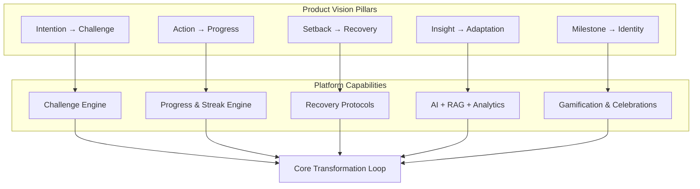
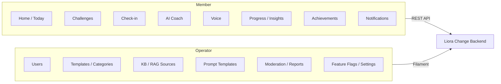
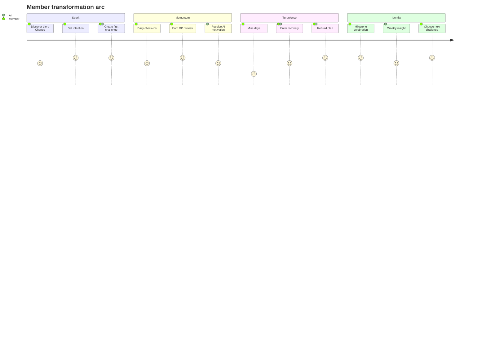
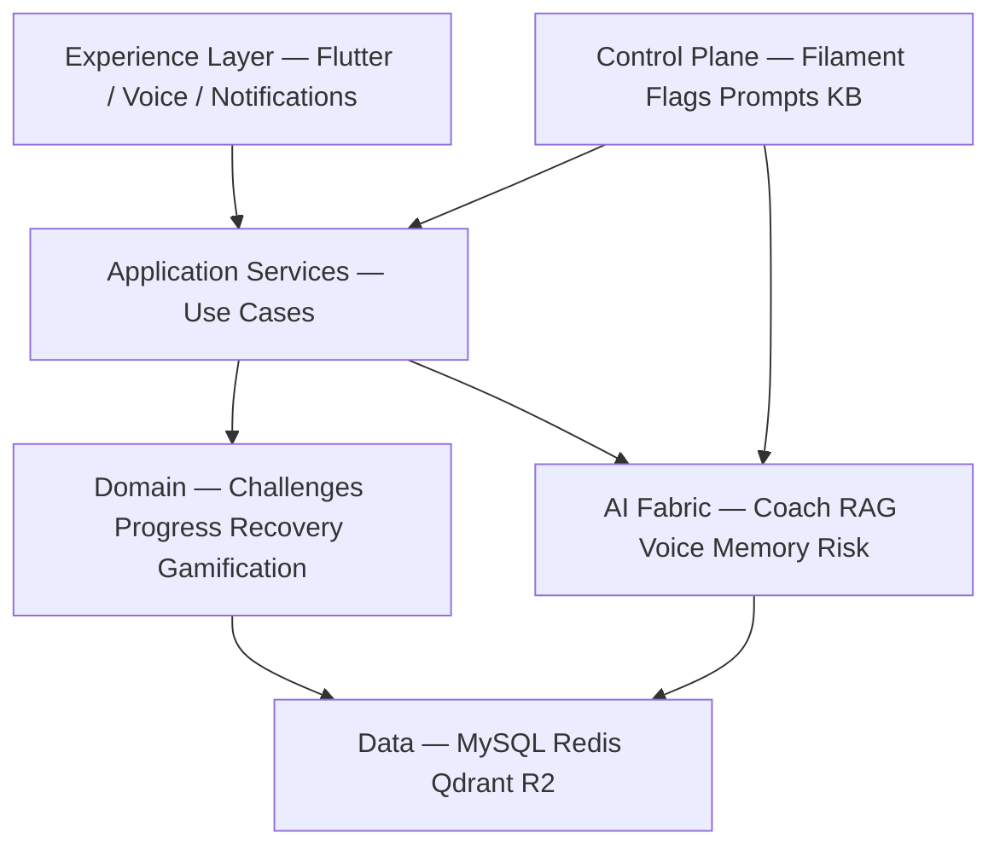
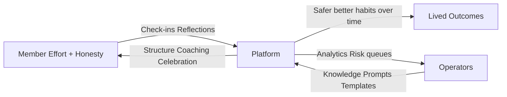
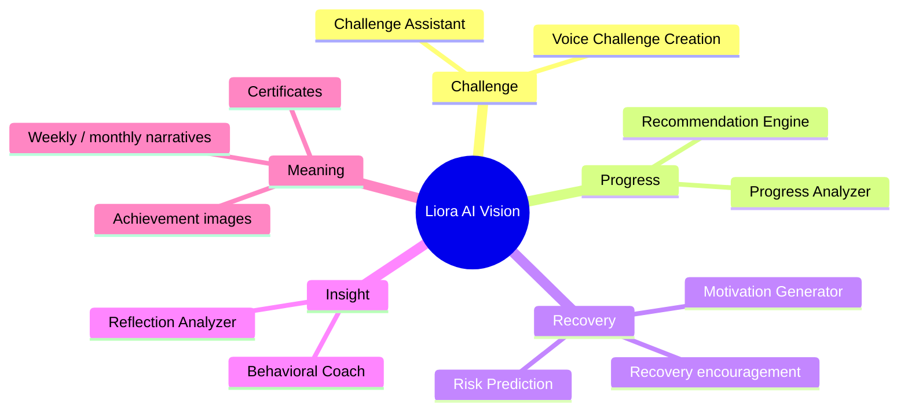

# Chapter 02 — Product Vision

**Document ID:** LC-ARCH-02  
**Version:** 1.0  
**Status:** Approved for engineering guidance  
**Owner:** Product Architect / CTO  
**Last Updated:** 2026-07-25  
**Depends On:** Chapter 01 — Executive Summary  
**Feeds Into:** Chapters 03–07, 14, 24–28, 50  

---

## 1. Business Context

### 1.1 Vision Statement

**Liora Change helps people become who they intend to be** — by turning fragile intentions into durable habits through science-backed challenges, compassionate recovery, accountable progress, and AI that coaches rather than merely reminds.

### 1.2 North Star

> Every member can start a meaningful change, survive setbacks without shame, and sustain progress long enough for identity to shift.

Success is not “more checkboxes completed.” Success is **sustained behavioral change with dignity**.

### 1.3 Product Thesis

Most digital habit products optimize for logging. Logging is necessary but insufficient. Lasting change requires:

1. **Clear intention** — a specific, meaningful goal  
2. **Designed environment** — cues, tiny starts, friction removal  
3. **Accountability structure** — challenges with cadence and commitment  
4. **Feedback loops** — progress visibility without toxic pressure  
5. **Recovery protocols** — relapse is data, not identity failure  
6. **Personalized coaching** — timing, tone, language, and method adapted to the person  
7. **Celebration & meaning** — milestones that reinforce identity, not vanity metrics  

Liora Change is the operating system for that loop.

### 1.4 Brand Promise

| Promise | Meaning for Product |
|---------|---------------------|
| Compassionate consistency | Streaks exist; forgiveness and recovery are first-class |
| Science with soul | Behavioral frameworks inform design; tone stays human |
| AI that serves, not replaces | AI coaches and personalizes; humans own values and governance |
| Voice as access | Change should be possible when typing is hard |
| Inclusive language | Multilingual, Amharic-capable voice path, culturally aware coaching |
| Long game | Weekly/monthly growth narratives, not only daily greenery |

### 1.5 What We Explicitly Are Not

| Not This | Why |
|----------|-----|
| Clinical therapy / medical device | We coach behavior; we do not diagnose or treat |
| Pure social network | Accountability may grow socially later; core loop is personal transformation |
| Guilt engine | No dark-pattern shame for missed days |
| Generic chatbot wrapper | AI is grounded in product context, RAG, and user history |
| One-size challenge marketplace only | Templates help; personalization and recovery define the product |

### 1.6 Target Outcomes by Stakeholder

| Stakeholder | Desired Outcome |
|-------------|-----------------|
| Member | Feel capable, consistent, and supported through change |
| Returning member after lapse | Re-enter without humiliation; restart with a smarter plan |
| Admin / operator | Curate safe, effective knowledge, prompts, and challenges |
| Human coach / moderator | Intervene on risk escalations with clear context |
| Business | Retention driven by real progress and trust, not addiction mechanics |
| Engineering | Stable domain language and extensible AI surfaces |

---

## 2. Technical Design

### 2.1 Vision → System Mapping

The product vision maps to five durable system capabilities. Engineering must preserve these invariants even as features expand.

### 2.2 Product Pillars (Detailed)

#### Pillar A — Structured Challenges
Challenges are the primary container of commitment. They encode duration, frequency, category, difficulty, cues, and success criteria. Templates accelerate start; AI and voice accelerate personalization.

#### Pillar B — Humane Progress
Check-ins capture action, mood, energy, and optional reflection. Streaks reward consistency; **missed days trigger recovery flows**, not only streak resets.

#### Pillar C — AI Coaching Fabric
Multiple AI roles share one orchestration layer: challenge assistant, habit coach, behavioral coach, motivation, reflection analyzer, progress analyzer, recommender, risk predictor, notification writer, translator.

#### Pillar D — Voice-Native Access
Members can create challenges, check in, reflect, and receive coaching by voice. Amharic TTS via Addis AI; international TTS via ElevenLabs; STT via Addis AI — all behind a provider-agnostic voice port.

#### Pillar E — Meaning & Motivation
XP, levels, badges, rewards, AI-generated achievement imagery, and certificates celebrate progress. Gamification is subordinate to wellbeing; rules must avoid compulsive harm.

### 2.3 Experience Principles (Design Contracts)

| Principle | Engineering Implication |
|-----------|-------------------------|
| Time-to-first-win &lt; 5 minutes | Onboarding + template/AI challenge creation must be low-latency |
| Never punish honesty | Logging a miss must be easy and non-shaming in UX copy and AI tone |
| Continuity across channels | Text, push, and voice share conversation/memory context |
| Explainable personalization | Recommendations cite signals (streak, mood, category) where useful |
| Offline-tolerant mobile core | Local cache (Hive) for essential challenge/progress read paths |
| Locale as first-class | Language + timezone drive notifications, TTS, and prompt selection |

### 2.4 Product Surfaces

### 2.5 Differentiation Strategy (Product Architecture)

1. **Recovery-first loop** as a core domain object, not a help-center article.  
2. **RAG-grounded coaching** from behavioral science + user history.  
3. **Risk prediction** that triggers supportive interventions, not surveillance theater.  
4. **Multilingual voice**, with Amharic as a strategic capability.  
5. **Admin-governed AI** (prompts, knowledge, moderation) so quality improves without app releases.  

---

## 3. Architecture Decisions

| ADR ID | Decision | Rationale |
|--------|----------|-----------|
| ADR-013 | Challenge is the core commitment aggregate | Unifies habits, goals, and programs under one evolvable model |
| ADR-014 | Recovery is a first-class domain flow | Differentiates from streak-only trackers; protects brand promise |
| ADR-015 | Identity shift is a measured product outcome | Analytics and AI narratives optimize for long-term change, not only DAU |
| ADR-016 | AI roles share one orchestration boundary | Prevents fragmented prompt/provider sprawl across features |
| ADR-017 | Voice is a channel, not a separate product | Same domain commands (create challenge, check in) via alternate interface |
| ADR-018 | Non-clinical positioning enforced in prompts & copy | Legal/safety boundary; reduces medical-claim risk |
| ADR-019 | Gamification ethics guardrails | XP/streaks configurable; shame patterns disallowed by product policy |
| ADR-020 | Admin-operable content & prompts | Product quality iterates via Filament without waiting on mobile releases |

---

## 4. Mermaid Diagrams

### 4.1 Vision Narrative (Member Journey Arc)

### 4.2 Vision Capability Stack

### 4.3 Value Exchange Model

---

## 5. API Implications

### 5.1 Vision-Driven API Priorities

APIs must make the transformation loop easy to implement on Flutter and voice:

| Vision Need | API Direction |
|-------------|---------------|
| Fast first win | Challenge templates + create-draft + activate endpoints |
| Honest check-ins | Check-in create accepts miss/partial/complete without penalty UX in contract naming |
| Recovery | Explicit recovery resources/actions, not only streak reset side effects |
| Coaching continuity | Conversation/thread IDs; memory references opaque to clients |
| Voice parity | Voice session commands map to the same domain commands as REST |
| Celebration | Achievement and certificate retrieval endpoints; async generation jobs |
| Multilingual | Locale on user profile; content negotiation for AI outputs |

### 5.2 Naming & Semantics

- Prefer **challenge**, **check-in**, **recovery**, **reflection**, **coach**, **risk** — align public API language with product vision.  
- Avoid tracker-centric naming (`todo`, `fail_count` as primary concepts).  
- AI endpoints should express **intent** (`/ai/coach/motivate`) rather than vendor verbs (`/openai/chat`).  

### 5.3 Contract Stability

Vision-level resources (Challenge, CheckIn, RecoverySession, CoachThread) are long-lived aggregates. Additive fields are preferred; breaking renames require API version bumps (Chapter 19).

---

## 6. Database Implications

### 6.1 Vision → Data Ownership

| Vision Concept | Likely Persistent Form | Notes |
|----------------|------------------------|-------|
| Intention / Goal | Challenge + goal fields / metadata | Keep goal narrative with challenge |
| Commitment | Challenge status lifecycle | draft → active → paused → completed → abandoned |
| Action | Check-ins | High write volume; archive strategy later |
| Setback | Missed check-ins + recovery sessions | Do not model only as null streaks |
| Insight | Reflections + AI analysis records | Sensitive; retention policy required |
| Identity markers | Levels, badges, certificates, narrative summaries | Generated artifacts in R2 |
| Coaching continuity | Conversation + memory pointers | Full transcripts may be retention-limited |
| Risk | Risk scores / alerts | Time-series friendly |

### 6.2 Product Data Ethics

- Store **only what improves coaching or safety**.  
- Voice audio: prefer short retention after STT unless user opts into saving.  
- Reflections: encrypt/protect; restrict admin access by role.  
- Soft deletes support right-to-erasure workflows (Chapter 38).  

Detailed schemas: Chapters 15–17.

---

## 7. AI Implications

### 7.1 AI’s Role in the Vision

AI is the **adaptive coach and translator of context into timely support**. It does not own the member’s values or replace human clinical care.

### 7.2 Vision Constraints on AI Behavior

| Constraint | Product Rule |
|------------|--------------|
| Compassion | Prefer encouraging, specific, actionable language |
| Grounding | Prefer RAG + user facts over generic pep talks |
| Honesty | Acknowledge setbacks; never fabricate progress |
| Boundaries | No diagnosis, medication advice, or crisis therapy claims |
| Escalation | Risk/crisis patterns route to safe resources + human review paths |
| Locale | Respond in preferred language; Amharic voice path supported |
| Consistency | Same member context across coach, notifications, and voice |

### 7.3 AI Feature Alignment to Pillars

---

## 8. Security Considerations

### 8.1 Vision-Linked Trust Requirements

Trust is a product feature. Members share mood, failures, and private reflections. Engineering must treat confidentiality as part of the brand promise.

| Trust Need | Control Direction |
|------------|-------------------|
| Private reflections | Strict authZ; minimized admin access; audit reads |
| Voice data | Secure upload, short retention, encrypted transit |
| AI leakage | No training on customer content with providers that retain by default unless contracted otherwise |
| Child safety | Age gates / policy; block sexual/minor-exploitative content; refuse disallowed contexts |
| Manipulation risk | No deceptive notifications; frequency caps; user controls |

### 8.2 Safety Positioning

Product vision includes helping through setbacks. If content indicates self-harm or acute crisis, the system must **not role-play as a therapist**; it should provide supportive language and direct users to appropriate external resources (detailed in Chapters 27, 37, 47).

---

## 9. Risks

| Risk | Vision Impact | Mitigation |
|------|---------------|------------|
| Product dilutes into generic tracker | Lose differentiation | Guardrail: recovery + AI coaching always in roadmap critical path |
| AI tone becomes preachy or clinical | Trust erosion | Prompt style guides + eval sets + moderation |
| Over-indexing on gamification | Shame / addiction dynamics | Ethics ADR-019; configurable XP; recovery overrides streak theater |
| Vision too broad for MVP | Delayed learning | Chapter 50 phases; core loop first |
| Cultural misfit in coaching | Alienation in key markets | Locale evals; Amharic QA; human review |
| Medical-claim creep in copy | Legal/safety risk | ADR-018; legal review of templates |
| Voice quality gap | Channel abandonment | Provider abstraction + fallback TTS + offline text path |

---

## 10. Future Scalability

### 10.1 Vision Evolution Paths

| Horizon | Vision Expansion | Architecture Readiness |
|---------|------------------|------------------------|
| Near | Personal challenges + AI coach + voice check-ins | Modular monolith |
| Mid | Social accountability circles, coach marketplace | New bounded contexts; careful privacy |
| Mid | Web companion experiences | Same API contracts |
| Long | Organization / workplace wellbeing programs | Tenancy, SSO, admin hierarchies |
| Long | Deeper personalization models | Feature store + stronger eval harness |

### 10.2 Preserving Vision Under Scale

- Personalization quality must not degrade into spammy notifications as user count grows.  
- Recovery protocols must remain humane when automation increases.  
- Knowledge base and prompts must scale via admin tooling, not engineer bottlenecks.  

---

## 11. Acceptance Criteria

This chapter is accepted when stakeholders agree that:

1. **Vision statement** is the north star for product and engineering decisions.  
2. **Differentiation** is recovery-first transformation + governed AI/voice — not checkbox tracking.  
3. **Non-goals** are explicit (non-clinical, non-shame, non-generic chatbot).  
4. **Five pillars** (Challenges, Humane Progress, AI Fabric, Voice Access, Meaning) are recognized as durable capability boundaries.  
5. **Experience principles** are treated as design contracts for mobile, API, and AI tone.  
6. **API/DB/AI implications** align naming and aggregates to the vision language.  
7. **Trust and safety** are part of the product vision, not only compliance afterthoughts.  
8. **ADRs 013–020** are adopted for subsequent chapters.  
9. **Roadmap sequencing** may phase features, but must not contradict the core transformation loop.  
10. Documentation remains design-only; no implementation is authorized by this chapter alone.

---

## 12. Vision One-Pager

**For** people who want to change their lives but struggle to stay consistent,  
**Liora Change** is a behavioral transformation platform  
**that** turns intentions into sustainable habits through structured challenges, compassionate recovery, gamified meaning, and AI/voice coaching  
**unlike** habit trackers that only log streaks and punish failure  
**our product** helps members build identity-level change — safely, personally, and in their language.

---

*End of Chapter 02 — Product Vision*  
*Next: Chapter 03 — Business Goals*
