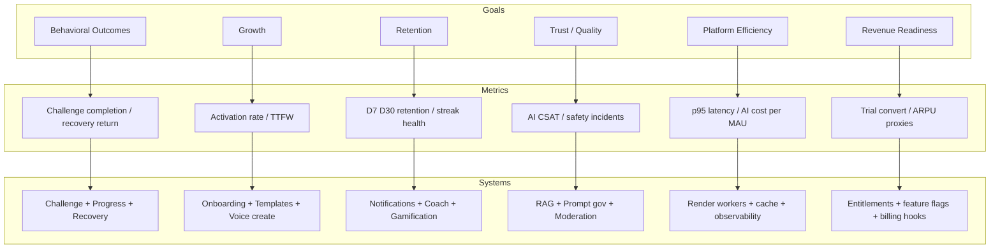
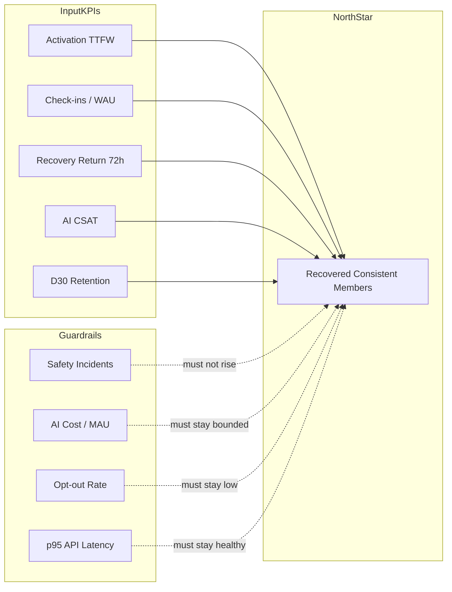
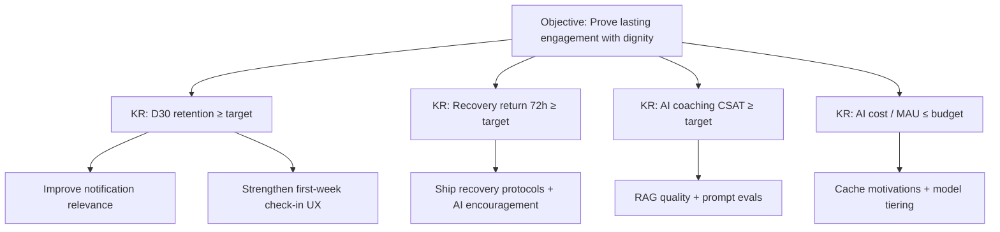
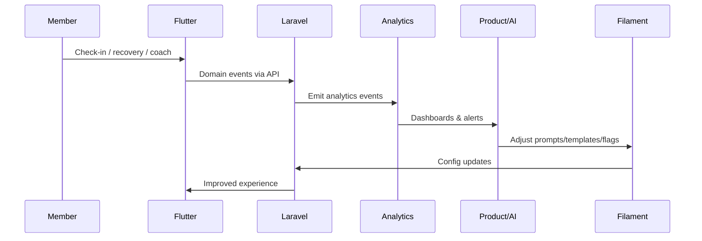

# Chapter 03 — Business Goals

**Document ID:** LC-ARCH-03  
**Version:** 1.0  
**Status:** Approved for engineering guidance  
**Owner:** CTO / Product Architect  
**Last Updated:** 2026-07-25  
**Depends On:** Chapters 01–02  
**Feeds Into:** Chapters 04–07, 29, 39, 44, 46, 50  

---

## 1. Business Context

### 1.1 Purpose of This Chapter

Translate Liora Change’s vision into **measurable business goals** that engineering, product, AI, and operations can optimize against. Goals define *what success looks like*; later chapters define *how systems achieve it*.

### 1.2 Business Mission Alignment

| Layer | Statement |
|-------|-----------|
| Mission | Transform intentions into sustainable habits |
| Vision | Identity-level change with dignity |
| Business goals | Grow a trusted, retained, monetizable member base by delivering measurable behavioral outcomes |

### 1.3 Goal Framework

Goals are organized as:

1. **Outcome goals** — member behavioral results  
2. **Growth goals** — acquisition and activation  
3. **Retention & engagement goals** — habit of using the product  
4. **Quality & trust goals** — safety, coaching quality, brand  
5. **Platform & efficiency goals** — delivery speed, cost, reliability  
6. **Revenue goals** — sustainable business model readiness  

Each goal includes metric direction, primary owner, and architecture implications.

### 1.4 Strategic Time Horizons

| Horizon | Window | Business Focus |
|---------|--------|----------------|
| H0 | 0–3 months | Prove core loop; learn retention drivers |
| H1 | 3–9 months | Scale activation; AI coaching quality; voice MVP |
| H2 | 9–18 months | Monetization readiness; multilingual depth; analytics maturity |
| H3 | 18–36 months | Mass-scale efficiency; optional B2B/org expansion |

Exact roadmap sequencing lives in Chapter 50; this chapter defines the **goal targets** those phases serve.

---

## 2. Technical Design

### 2.1 Goal → Metric → System Map

### 2.2 Outcome Goals (Member Value)

| ID | Goal | Primary Metrics | Target Direction (H1) |
|----|------|-----------------|------------------------|
| OG-1 | Members complete meaningful challenges | Challenge completion rate; median active days / challenge | ↑ completion; ↑ active days |
| OG-2 | Members recover after setbacks | % of missed-streak users who check in within 72h of recovery prompt | ↑ recovery return |
| OG-3 | Members build consistency | Healthy streak distribution; miss rate without abandonment | ↑ consistency; ↓ abandonment after miss |
| OG-4 | Members feel coached, not judged | In-app coaching CSAT / thumbs; qualitative reflection themes | ↑ CSAT; ↓ “shame” theme rate |
| OG-5 | Members achieve identity-relevant milestones | Badges/certificates earned; weekly insight open rate | ↑ meaningful celebrations |

**Product rule:** Vanity metrics (raw XP, push volume) never outrank OG-1–OG-4.

### 2.3 Growth Goals

| ID | Goal | Primary Metrics | Notes |
|----|------|-----------------|-------|
| GG-1 | Efficient acquisition | Install → register conversion | Attribution later; instrument early |
| GG-2 | Fast activation | Time-to-first-win (TTFW); % creating first challenge &lt; 24h | Templates + AI/voice create |
| GG-3 | First-week engagement | % with ≥3 check-ins in first 7 days | Predicts retention |
| GG-4 | Locale expansion readiness | Amharic and English successful voice/text sessions | Strategic market capability |

### 2.4 Retention & Engagement Goals

| ID | Goal | Primary Metrics |
|----|------|-----------------|
| RG-1 | Short-term retention | D1 / D7 retention |
| RG-2 | Habit retention | D30 retention; weekly active challenges |
| RG-3 | Notification effectiveness | Open rate, positive action rate, unsubscribe/opt-down rate |
| RG-4 | AI continuity | Coach thread return rate; voice session repeat rate |
| RG-5 | Reduce silent churn | Risk-score precision/recall proxies; intervention acceptance |

### 2.5 Trust & Quality Goals

| ID | Goal | Primary Metrics |
|----|------|-----------------|
| TQ-1 | AI safety | Policy-block rate; critical incident count (target: near-zero) |
| TQ-2 | Coaching groundedness | RAG citation coverage; hallucination eval fail rate |
| TQ-3 | Privacy trust | Data deletion SLA; access-audit anomalies |
| TQ-4 | Content quality | KB freshness; admin moderation turnaround |
| TQ-5 | Reliability perception | Crash-free sessions; API availability |

### 2.6 Platform & Efficiency Goals

| ID | Goal | Primary Metrics |
|----|------|-----------------|
| PE-1 | API performance | p95 latency for core sync endpoints |
| PE-2 | AI cost efficiency | AI $ per MAU; cache hit rate for motivations |
| PE-3 | Delivery velocity | Lead time for change; failed deploy rate |
| PE-4 | Worker health | Queue lag by lane; job failure rate |
| PE-5 | Observability completeness | % critical paths with alerts |

### 2.7 Revenue Readiness Goals

Revenue model may include freemium, subscriptions, or B2B later. Engineering prepares **entitlements** without hardcoding a single commercial model.

| ID | Goal | Primary Metrics / Proxies |
|----|------|---------------------------|
| RV-1 | Willingness-to-pay signals | Feature usage of premium-capable AI/voice |
| RV-2 | Entitlement plumbing | Feature flags + plan gates test coverage |
| RV-3 | Conversion readiness | Trial start → activate proxies (when billing exists) |
| RV-4 | Gross margin awareness | Infra + AI COGS tracked per cohort |

### 2.8 KPI Scorecard (Executive)

**North-star definition (working):**  
*Weekly active members who maintain an active challenge **or** successfully re-enter via recovery within the week.*

This privileges consistency **and** compassionate return over streak perfection.

### 2.9 Goal Owners

| Goal Cluster | Primary Owner | Supporting |
|--------------|---------------|------------|
| Outcomes | Product | Behavioral design, AI |
| Growth | Product + Growth | Mobile, Backend |
| Retention | Product | Notifications, AI, Mobile |
| Trust/Quality | Security + AI Lead | Admin, Backend |
| Platform efficiency | Eng Manager / DevOps | Backend, SRE practices |
| Revenue readiness | Product + CTO | Backend entitlements |

---

## 3. Architecture Decisions

| ADR ID | Decision | Rationale |
|--------|----------|-----------|
| ADR-021 | North-star = recovered consistent members | Aligns business success with vision (consistency + dignity) |
| ADR-022 | Guardrail metrics are first-class | Prevent optimizing retention via spam or unsafe AI |
| ADR-023 | Instrument before monetize | Event taxonomy and analytics early; billing can follow |
| ADR-024 | Entitlements via flags/plans abstraction | Avoid rewrite when pricing launches |
| ADR-025 | AI cost is a product KPI | Coaching features must meet margin constraints |
| ADR-026 | Activation TTFW is a release gate for onboarding changes | Protect growth goal GG-2 |
| ADR-027 | Recovery return is a core dashboard metric | Forces recovery flows to stay invested |
| ADR-028 | Separate vanity from outcome dashboards | Admin analytics must highlight OG/RG metrics first |

---

## 4. Mermaid Diagrams

### 4.1 OKR-Style Cascade (Illustrative H1)

> Numeric thresholds are environment-specific and set in product ops docs; architecture requires the **metric plumbing**, not frozen vanity numbers in code.

### 4.2 Funnel Goals

### 4.3 Business Goal Feedback Loop

---

## 5. API Implications

### 5.1 Instrumentation Contracts

Business goals require stable analytics events from API mutations:

| Event (conceptual) | Fired When | Goal Support |
|--------------------|------------|--------------|
| `user.registered` | Register success | GG-1 |
| `challenge.created` / `challenge.activated` | Draft/activate | GG-2, OG-1 |
| `checkin.recorded` | Check-in create | GG-3, RG-1/2 |
| `recovery.started` / `recovery.completed` | Recovery flow | OG-2, RG-5 |
| `ai.coach.responded` | Coach completion | TQ-2, PE-2 |
| `ai.feedback.submitted` | Thumbs / CSAT | TQ-1/2, OG-4 |
| `notification.sent` / `opened` / `acted` | Push lifecycle | RG-3 |
| `voice.session.completed` | Voice flow done | GG-4, RG-4 |
| `achievement.earned` | Badge/cert | OG-5 |
| `risk.alert.created` | Risk engine | RG-5, TQ-1 |

### 5.2 API Design Rules for Goals

- Mutations that affect goals must be **idempotent** and **event-safe** (outbox / domain events).  
- Client timestamps + server timestamps for timezone-correct retention cohorts.  
- Preference endpoints for notification frequency (protect RG-3 guardrails).  
- Feature-flag headers or entitlements endpoint for RV-2 experiments.  

### 5.3 Admin Analytics APIs / Filament

Filament dashboards must expose OG/RG/TQ/PE scorecards; raw tables alone are insufficient for ADR-028.

---

## 6. Database Implications

### 6.1 Data Needed for Goals

| Goal Cluster | Data Artifacts |
|--------------|----------------|
| Outcomes | challenges, check_ins, recovery_sessions, streaks |
| Growth | users, onboarding_states, attribution (optional) |
| Retention | sessions/app opens (mobile), notification_logs |
| Trust | ai_interactions, moderation_flags, audit_logs |
| Efficiency | job metrics (Redis/queue monitors), ai_usage_ledger |
| Revenue | plans, entitlements (future), feature_flag_exposures |

### 6.2 Analytics Storage Posture

- **Operational DB (MySQL):** source facts.  
- **Derived metrics:** materialized daily rollups or warehouse export later.  
- **AI usage ledger:** tokens, model, latency, cost estimate per request — required for PE-2 and RV-4.  
- Avoid computing D30 retention by full table scans on hot paths; use rollup jobs (Chapter 29, 34).  

### 6.3 Privacy vs Metrics

Event payloads must minimize PII. Reflections content should not flow into generic analytics tools by default; use aggregated or redacted derivatives (Chapter 38).

---

## 7. AI Implications

### 7.1 AI Features as Goal Levers

| AI Feature | Primary Goals Served |
|------------|----------------------|
| Challenge Assistant | GG-2, OG-1 |
| Habit / Behavioral Coach | OG-4, RG-4 |
| Motivation Generator | RG-1/2, OG-3 |
| Reflection Analyzer | OG-4, OG-5 |
| Progress Analyzer | OG-1, RG-2 |
| Recommendation Engine | OG-1, RG-2 |
| Risk Prediction | RG-5, TQ-1 |
| Personalized Notifications | RG-3 (with guardrails) |
| Voice Assistant | GG-2, GG-4, RG-4 |
| Translation / Multilingual | GG-4, TQ-4 |

### 7.2 AI Optimization Constraints

- Maximize OG/RG metrics **subject to** TQ safety and PE cost guardrails.  
- Prefer cheaper models / cached copy for routine motivations; reserve stronger models for recovery and risk.  
- Every AI surface should support feedback capture for TQ-2.  

### 7.3 Prompt/KB Ops Goals

Admin improvements to prompts and knowledge should show measurable movement on AI CSAT and recovery return — closing the loop between Filament and business KPIs.

---

## 8. Security Considerations

| Goal Pressure | Security/Privacy Risk | Control |
|---------------|----------------------|---------|
| Growth hacking via aggressive push | Spam, distrust, policy violations | Frequency caps, preference center, quiet hours |
| Retention via emotional manipulation | Ethical harm, brand damage | Tone policies, ethics review, ADR-019 |
| Cost cutting on AI moderation | Safety regressions | Keep moderation non-optional for high-risk intents |
| Rich analytics | PII leakage | Redaction, access control, vendor DPA |
| Revenue experiments | Unfair gating / dark patterns | Transparent entitlements; no hostage of recovery features |

**Policy:** Recovery encouragement and basic check-in must remain available on free tiers when monetization launches — dignity is not a premium upsell.

---

## 9. Risks

| Risk | Impact on Goals | Mitigation |
|------|-----------------|------------|
| Optimizing D7 with spammy notifications | Short spike, long churn, high opt-out | Guardrail H + RG-3 action rate |
| Streak worship over recovery | Hurts OG-2 and brand | North-star includes recovery |
| AI cost overruns | Breaks PE-2 / margins | Usage ledger, budgets, cache |
| Metric gaming by clients | Corrupt analytics | Server-side event authority |
| No baseline instrumentation | Flying blind | Event taxonomy in MVP scope |
| Premature monetization | Trust damage | RV goals are readiness, not forced launch |
| Locale quality debt | Miss GG-4 | Eval sets + human review |
| Conflicting OKRs across teams | Thrash | Single scorecard ownership |

---

## 10. Future Scalability

### 10.1 Metric System Evolution

| Stage | Analytics Posture |
|-------|-------------------|
| H0 | MySQL facts + simple Filament widgets + event log |
| H1 | Daily rollups; cohort retention jobs; AI cost dashboard |
| H2 | Warehouse export (BigQuery/Snowflake/etc.) optional |
| H3 | Experimentation platform; causal analysis for interventions |

### 10.2 Goal Stability Under Scale

As volume grows:

- Retention math must use rollups/cohort tables.  
- Risk prediction must stay precision-aware to avoid alert fatigue.  
- Cost KPIs must allocate AI spend by feature and locale.  

### 10.3 Business Expansion Goals (Later)

| Expansion | New Goal Themes |
|-----------|-----------------|
| Consumer subscriptions | Conversion, churn, LTV |
| Family / accountability pairs | Invite success, shared challenge retention |
| Org / workplace | Seat utilization, admin NPS, SSO adoption |
| Coach marketplace | Marketplace GMV, coach CSAT (optional) |

Architecture keeps tenancy and roles open without implementing them prematurely.

---

## 11. Acceptance Criteria

This chapter is accepted when stakeholders agree that:

1. **North-star metric** is “recovered consistent members” (or an approved equivalent).  
2. Goal clusters OG / GG / RG / TQ / PE / RV are the official scorecard structure.  
3. **Guardrail metrics** (safety, cost, opt-out, latency) constrain optimization.  
4. Activation **TTFW** and **recovery return 72h** are mandatory product KPIs.  
5. AI features are mapped to goals and cost/safety constraints.  
6. Analytics event taxonomy is required for MVP instrumentation.  
7. Monetization is prepared via entitlements, not hardwired prematurely.  
8. Recovery/basic progress remains non-premium when revenue launches.  
9. ADRs 021–028 are adopted.  
10. Numeric targets may live in ops docs, but **metric plumbing** is an engineering requirement.

---

## 12. Business Goals One-Pager

**Win** when members consistently pursue challenges and return after setbacks.  
**Grow** by collapsing time-to-first-win.  
**Retain** with relevant coaching and humane notifications.  
**Earn trust** with safe, grounded AI and strong privacy.  
**Operate** within latency and AI cost budgets.  
**Prepare** revenue through entitlements without selling dignity.

---

*End of Chapter 03 — Business Goals*  
*Next: Chapter 04 — User Personas*
