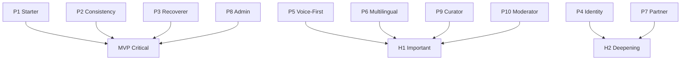
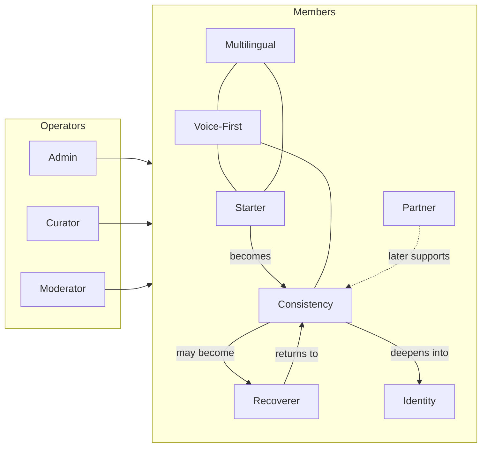
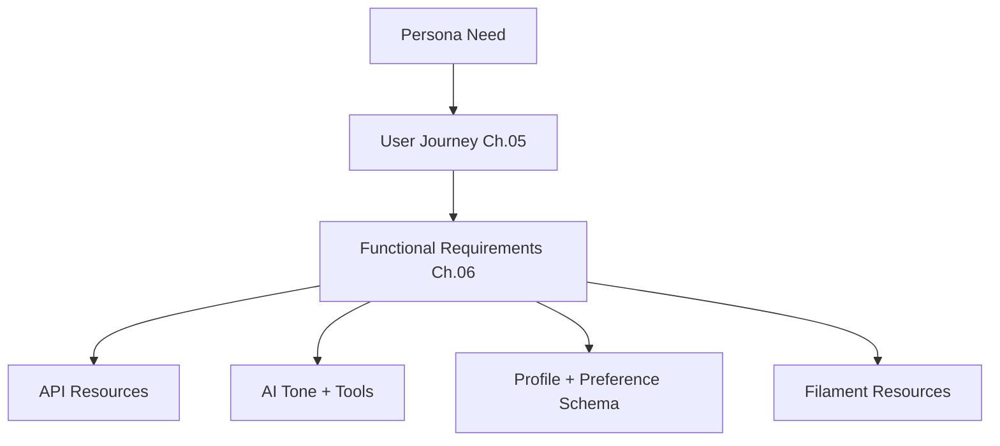
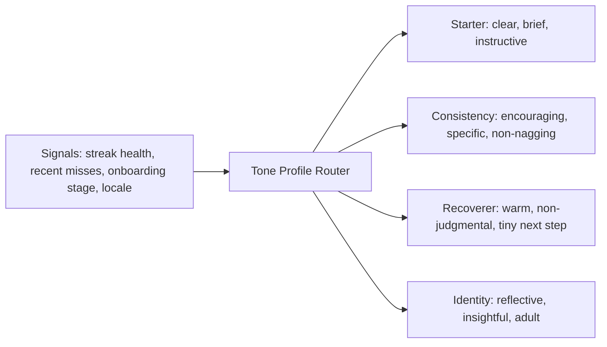

# Chapter 04 — User Personas

**Document ID:** LC-ARCH-04  
**Version:** 1.0  
**Status:** Approved for engineering guidance  
**Owner:** Product Architect  
**Last Updated:** 2026-07-25  
**Depends On:** Chapters 01–03  
**Feeds Into:** Chapters 05–07, 14, 22, 24–28, 31, 38, 50  

---

## 1. Business Context

### 1.1 Purpose

Define the **canonical personas** that drive UX, API priorities, AI tone, notification strategy, admin tooling, and roadmap sequencing. Personas are archetypes grounded in behavioral-change reality — not demographic stereotypes alone.

### 1.2 Persona Principles

1. **Job-to-be-done first** — what change are they hiring Liora for?  
2. **Failure mode second** — how do they usually quit?  
3. **Channel preference** — text, voice, notifications, or mixed.  
4. **Sensitivity level** — how private/shame-prone is the domain?  
5. **Locale & language** — English, Amharic, multilingual needs.  
6. **Operator personas** — admins and moderators are first-class.  

### 1.3 Persona Portfolio Overview

| ID | Persona | Type | Primary Job |
|----|---------|------|-------------|
| P1 | Intentional Starter | Member | Start a clear first challenge fast |
| P2 | Consistency Seeker | Member | Build streaks without burning out |
| P3 | Relapse Recoverer | Member | Return after failure without shame |
| P4 | Identity Rebuilder | Member | Deep life change over months |
| P5 | Voice-First Member | Member | Interact mostly by speech |
| P6 | Multilingual Navigator | Member | Operate in Amharic / mixed languages |
| P7 | Accountability Partner | Member (social-lite) | Support someone else’s challenge |
| P8 | Platform Admin | Operator | Run content, flags, settings |
| P9 | Knowledge Curator | Operator | Manage RAG sources & prompts |
| P10 | Safety Moderator | Operator | Handle reports, risk escalations |

Secondary future personas (not MVP-critical): Workplace Champion, Professional Coach, Parent/Guardian (family plans).

---

## 2. Technical Design

### 2.1 Persona → Capability Matrix

| Capability | P1 | P2 | P3 | P4 | P5 | P6 | P7 | P8–P10 |
|------------|----|----|----|----|----|----|----|--------|
| Templates / quick create | ● | ◐ | ◐ | ◐ | ● | ● | ○ | ● |
| Check-ins + streaks | ◐ | ● | ● | ● | ● | ● | ◐ | ○ |
| Recovery flows | ◐ | ◐ | ● | ● | ● | ● | ◐ | ◐ |
| AI coach | ◐ | ● | ● | ● | ● | ● | ○ | ◐ |
| Voice | ◐ | ◐ | ◐ | ◐ | ● | ● | ○ | ○ |
| Multilingual / Amharic | ◐ | ◐ | ◐ | ◐ | ◐ | ● | ○ | ● |
| Gamification | ◐ | ● | ◐ | ● | ◐ | ◐ | ◐ | ● |
| Insights / analytics | ○ | ◐ | ◐ | ● | ○ | ◐ | ○ | ● |
| Admin / Filament | ○ | ○ | ○ | ○ | ○ | ○ | ○ | ● |

● primary · ◐ secondary · ○ minimal

### 2.2 Shared Member Profile Attributes

All member personas share a profile model that engineering must support:

| Attribute | Why |
|-----------|-----|
| Display name | Identity & certificates |
| Locale / preferred language | AI, TTS, notifications |
| Timezone | Scheduling quiet hours |
| Goals / focus categories | Recommendations |
| Notification preferences | Retention without spam |
| Voice preference | Addis vs ElevenLabs path |
| Sensitivity flags | Softer tone / private categories |
| Entitlement / plan | Future monetization |
| Risk tier (system-computed) | Intervention intensity |
| Onboarding stage | Activation metrics |

### 2.3 Detailed Personas

---

#### P1 — Intentional Starter

**Portrait:** Ready to change something specific (e.g., morning routine, sugar, reading). High motivation, low system knowledge. Abandons products that feel complex.

| Dimension | Detail |
|-----------|--------|
| Goals | Create first challenge in minutes; feel immediate clarity |
| Frustrations | Endless setup, jargon, empty dashboards |
| Success moment | First check-in completed same day |
| Failure mode | Never activates challenge; app uninstall |
| Channels | Mobile UI primary; optional AI assist |
| AI needs | Challenge Assistant; short explanations |
| Metrics | TTFW, register → first challenge, first check-in |

**Design implications:** Opinionated templates, smart defaults, progressive disclosure, draft → activate happy path.

---

#### P2 — Consistency Seeker

**Portrait:** Already tried habit apps. Wants structure and feedback. Sensitive to broken streaks.

| Dimension | Detail |
|-----------|--------|
| Goals | Maintain cadence; see progress; stay motivated |
| Frustrations | Rigid streaks, spammy reminders, generic tips |
| Success moment | Multi-week healthy streak + weekly insight |
| Failure mode | Miss once → shame spiral → quit |
| Channels | Push + in-app coach |
| AI needs | Motivation Generator; Progress Analyzer; personalized reminders |
| Metrics | D7/D30, check-ins/WAU, notification action rate |

**Design implications:** Flexible streak policies, humane copy, high-quality notification personalization, week/month narratives.

---

#### P3 — Relapse Recoverer

**Portrait:** Knows the goal; cycles through start–stop. Carries guilt. Needs re-entry more than pep talks.

| Dimension | Detail |
|-----------|--------|
| Goals | Restart without humiliation; adjust plan to be smaller |
| Frustrations | “You broke your streak!” energy; all-or-nothing UX |
| Success moment | Recovery session completed; new tiny plan activated |
| Failure mode | Avoid opening app after a miss |
| Channels | Empathetic push; coach chat; optional voice |
| AI needs | Recovery encouragement; Behavioral Coach; Risk Prediction |
| Metrics | Recovery return 72h; post-miss 7-day retention |

**Design implications:** First-class RecoverySession UX, one-tap restart, AI tone constraints, risk alerts that feel supportive.

---

#### P4 — Identity Rebuilder

**Portrait:** Pursuing deep change (health identity, discipline, emotional regulation). Wants meaning and analysis over badges alone.

| Dimension | Detail |
|-----------|--------|
| Goals | Long-term transformation; understand patterns |
| Frustrations | Shallow gamification; no insight; short-termism |
| Success moment | Monthly summary shows identity-consistent behavior |
| Failure mode | Outgrows product; feels juvenile |
| Channels | Reflections + analytics + coach |
| AI needs | Reflection Analyzer; Behavioral Coach; Recommendation Engine |
| Metrics | Reflection rate, monthly summary engagement, challenge depth |

**Design implications:** Rich reflections, progress analysis, certificates with narrative, category depth, avoid childish UX for this segment.

---

#### P5 — Voice-First Member

**Portrait:** Prefers speaking while commuting, cooking, or when typing is hard. May have lower literacy comfort or high time scarcity.

| Dimension | Detail |
|-----------|--------|
| Goals | Check in and get coaching hands-free |
| Frustrations | Long forms; brittle voice UX; wrong language TTS |
| Success moment | Full check-in + coach reply by voice end-to-end |
| Failure mode | STT errors → abandoned session |
| Channels | Voice primary; UI fallback |
| AI needs | Voice Assistant; STT/TTS abstraction; short spoken replies |
| Metrics | Voice session completion, STT error recovery rate |

**Design implications:** Voice command grammar mapped to domain actions; confirmations; barge-in/cancel; offline-safe fallbacks later.

---

#### P6 — Multilingual Navigator

**Portrait:** Operates in Amharic, English, or switches. Needs culturally aware coaching and correct TTS.

| Dimension | Detail |
|-----------|--------|
| Goals | Use product fully in preferred language |
| Frustrations | English-only assumptions; broken Amharic TTS; translated nonsense |
| Success moment | Challenge + notification + voice in preferred language |
| Failure mode | Feels excluded; churns to local alternatives |
| Channels | Locale-aware UI + Addis AI Amharic path |
| AI needs | Translation; locale prompt variants; Amharic TTS |
| Metrics | Locale session success, Amharic CSAT, TTS fallback rate |

**Design implications:** `locale` first-class; prompt versioning by language; glossary for behavioral terms; human eval sets.

---

#### P7 — Accountability Partner *(phase-aware)*

**Portrait:** Supports a friend/partner’s challenge. Not the primary actor every day.

| Dimension | Detail |
|-----------|--------|
| Goals | Encourage without policing; know when support is needed |
| Frustrations | Oversharing private reflections; noisy alerts |
| Success moment | Partner re-engages after partner-enabled encouragement |
| Failure mode | Privacy conflict; relationship friction |
| Channels | Limited digests; optional shared challenge views |
| AI needs | Minimal; careful copy for third-party notifications |
| Metrics | Invite accept rate; partner-influenced recovery (later) |

**Design implications:** Explicit consent, minimal data sharing, separate authorization scopes. **Not required for MVP core loop**; design APIs so sharing can be added without schema pain.

---

#### P8 — Platform Admin

**Portrait:** Operates Liora Change day-to-day: users, challenges templates, categories, rewards, feature flags, settings.

| Dimension | Detail |
|-----------|--------|
| Goals | Safe ops without engineering tickets |
| Frustrations | Hidden configs; no audit trail; brittle tools |
| Success moment | Ship a template + flag rollout in Filament same day |
| Failure mode | Shadow IT / production hotfixes |
| Surfaces | Filament resources & system settings |
| Metrics | Time-to-config-change; error rate of admin actions |

**Design implications:** Strong Filament IA, RBAC, audit logs, preview/publish for templates.

---

#### P9 — Knowledge Curator

**Portrait:** Owns behavioral science KB, uploaded documents, RAG sources, prompt templates, FAQ.

| Dimension | Detail |
|-----------|--------|
| Goals | Improve grounded coaching quality continuously |
| Frustrations | Opaque embeddings; no versioning; hard rollbacks |
| Success moment | Publish KB vN → measurable AI CSAT lift |
| Failure mode | Stale/wrong knowledge → hallucinations |
| Surfaces | KB admin, prompt admin, eval hooks |
| Metrics | KB freshness, retrieval hit quality, eval pass rate |

**Design implications:** Document versioning, chunk preview, source citations, staged publish, rollback.

---

#### P10 — Safety Moderator

**Portrait:** Reviews reports, risky conversations, abusive content, crisis escalations.

| Dimension | Detail |
|-----------|--------|
| Goals | Fast triage; clear context; consistent policy |
| Frustrations | Missing transcripts; no severity; alert noise |
| Success moment | Critical case handled within SLA with audit trail |
| Failure mode | Missed crisis or over-blocking |
| Surfaces | Moderation queues, reports, risk alerts |
| Metrics | SLA compliance, false positive rate, incident count |

**Design implications:** Moderation console, severity taxonomy, redacted PII views, escalation playbooks.

---

### 2.4 Anti-Personas

| Anti-Persona | Why We Don’t Optimize Primary UX For Them |
|--------------|---------------------------------------------|
| Clinical patient seeking therapy | Non-clinical boundary |
| Extreme quantified-self power user only | Must not dominate IA away from starters/recoverers |
| Spam growth hacker admin | Ethics/guardrails conflict |
| Child under supported age | Policy & safety restrictions |

### 2.5 Persona Priority for MVP

---

## 3. Architecture Decisions

| ADR ID | Decision | Rationale |
|--------|----------|-----------|
| ADR-029 | Personas are canonical requirements inputs | Prevents feature drift toward generic tracker UX |
| ADR-030 | P1–P3 + P8 define MVP acceptance | Aligns with activation, retention, recovery, ops |
| ADR-031 | Locale and timezone are mandatory profile fields | Serves P5/P6 and notification goals |
| ADR-032 | Voice is a peer channel for domain actions | Serves P5 without forked business logic |
| ADR-033 | Operator personas get first-class Filament workflows | Quality/safety cannot depend on eng-only ops |
| ADR-034 | Accountability partner is phase-gated | Avoid social complexity before core loop works |
| ADR-035 | Tone profiles keyed by persona signals | AI can adapt (starter vs recoverer) without separate products |
| ADR-036 | Anti-personas bound marketing and AI claims | Protect non-clinical positioning |

---

## 4. Mermaid Diagrams

### 4.1 Persona Relationship Map

### 4.2 Persona Empathy → System

### 4.3 AI Tone Profiles by Persona Signal

---

## 5. API Implications

### 5.1 Profile & Preference Contracts

APIs must expose (and validate) persona-critical fields:

| Area | Endpoints (conceptual) | Personas Served |
|------|------------------------|-----------------|
| Profile | `GET/PATCH /me` | All members |
| Preferences | `GET/PATCH /me/preferences` | P2, P3, P5, P6 |
| Locale/Timezone | included in profile | P6, notifications |
| Voice settings | `/me/voice-preferences` | P5, P6 |
| Onboarding state | `/me/onboarding` | P1, GG metrics |
| Feedback | `/ai/feedback` | P2–P4 quality |

### 5.2 Authorization Nuances

- P7 (future): separate scopes like `partner:read_limited` — never inherit full reflection access.  
- P8–P10: Filament policies + admin ability matrix; moderator ≠ full admin.  
- Members must not see other members’ private reflections by default.

### 5.3 Representation Rules

- Avoid error messages that shame (“You failed”). Prefer actionable language.  
- Recovery endpoints named as recovery, not failure logs.  
- Voice session APIs return domain action results, not raw provider payloads.

---

## 6. Database Implications

### 6.1 Persona-Driven Data

| Data | Personas | Notes |
|------|----------|-------|
| `users` + profile fields | All | locale, timezone, display name |
| `user_preferences` | P2, P3, P5, P6 | notifications, voice, tone |
| `onboarding_states` | P1 | funnel analytics |
| `recovery_sessions` | P3 | first-class |
| `voice_sessions` | P5, P6 | retention-limited audio refs |
| `ai_tone_profile` or derived | P1–P4 | can be computed, not only stored |
| admin roles/permissions | P8–P10 | RBAC tables |
| `moderation_cases` | P10 | SLA tracking |
| `knowledge_documents` / `prompt_versions` | P9 | versioned |

### 6.2 Segmentation Without Rigidity

Do **not** store a single mandatory `persona_type` that locks UX forever. Prefer **signals** (onboarding complete, streak health, locale, voice usage). Optional `persona_tags` for analytics are fine.

---

## 7. AI Implications

### 7.1 Persona-Aware Coaching

| Persona | Default AI Behavior |
|---------|---------------------|
| P1 | Short, structured, template-aware guidance |
| P2 | Specific motivation tied to streak/category/progress |
| P3 | Tiny next step; normalize setbacks; avoid guilt |
| P4 | Deeper reflection prompts; pattern hypotheses (grounded) |
| P5 | Spoken-length responses; confirm critical actions |
| P6 | Native-language quality over literal translation |

### 7.2 Operator AI Tooling

- P9 needs retrieval debug views (what chunks were used).  
- P10 needs severity classification assistance with human final authority.  
- AI never auto-closes critical safety cases without human policy.

### 7.3 Evaluation Sets by Persona

Maintain golden eval conversations per persona (especially P3 and P6) as release gates for prompt changes (Chapter 47–48).

---

## 8. Security Considerations

| Persona Risk | Control |
|--------------|---------|
| P3/P4 sensitive reflections | Strict authZ; encryption in transit; limited admin access |
| P5 voice audio | Short retention; secure R2; consent |
| P6 language content | Same privacy bar across locales |
| P7 shared data (future) | Explicit consent; least data |
| P8 powerful admin | MFA recommended; audit logs |
| P9 prompt injection via KB uploads | Document sanitization; publish review |
| P10 case access | Need-to-know; redaction; access audits |
| Minors mis-asserting age | Age gate + reporting path |

---

## 9. Risks

| Risk | Impact | Mitigation |
|------|--------|------------|
| Building only for P2 power users | Weak activation (P1) | MVP prioritizes P1–P3 |
| Ignoring P3 emotionally | Brand rupture | Recovery as first-class domain |
| Voice bolted on later | Forked logic | ADR-032 channel model now |
| English-only AI quality | Exclude P6 | Locale prompts + evals |
| Admin under-tooled | Eng bottleneck | Filament roadmap for P8–P10 |
| Premature social (P7) | Privacy incidents | Phase gate ADR-034 |
| Persona stereotypes in AI | Offensive coaching | Signal-based tone, not demographic caricature |
| Too many personas in MVP scope | Slow delivery | Priority diagram enforced |

---

## 10. Future Scalability

### 10.1 Persona Expansion

| Future Persona | When to Introduce |
|----------------|-------------------|
| Workplace Champion | B2B horizon |
| Licensed Coach (human) | Marketplace / supervised coaching |
| Family Organizer | Family plans with strict privacy |
| Researcher / Analyst | Aggregated insights exports |

### 10.2 Personalization at Scale

As population grows, move from static persona tales to **clustering on behavioral signals** while keeping P1–P10 as design narratives for humans.

### 10.3 Accessibility

Voice-first and multilingual personas foreshadow broader accessibility (motor, literacy, situational). Architecture should keep channel adapters clean for future a11y surfaces.

---

## 11. Acceptance Criteria

This chapter is accepted when stakeholders agree that:

1. Personas **P1–P10** are the canonical set for design and engineering.  
2. **MVP critical personas** are P1, P2, P3, and P8.  
3. Profile must include **locale** and **timezone** (ADR-031).  
4. Voice is a **channel**, not a separate product (ADR-032).  
5. Operator personas require Filament-grade workflows (ADR-033).  
6. Accountability partner is **phase-gated** (ADR-034).  
7. AI tone adapts by **signals**, not rigid demographic stereotypes (ADR-035).  
8. Anti-personas bound clinical and unethical optimization (ADR-036).  
9. API/DB implications for preferences, recovery, voice, RBAC are acknowledged.  
10. Chapter 05 journeys will be written primarily through P1–P3 and P8 lenses first.

---

## 12. Personas One-Pager

**Build for the Starter** to activate,  
**serve the Consistency Seeker** to retain,  
**protect the Recoverer** to earn trust,  
**enable Voice and Multilingual members** to expand access,  
**arm Admins, Curators, and Moderators** to keep quality and safety high —  
and delay social/partner complexity until the core loop is proven.

---

*End of Chapter 04 — User Personas*  
*Next: Chapter 05 — User Journeys*
