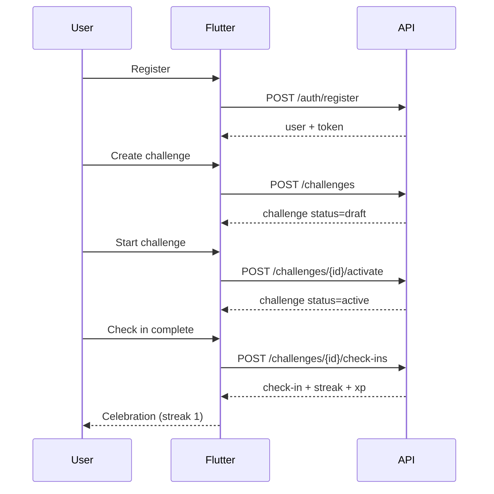
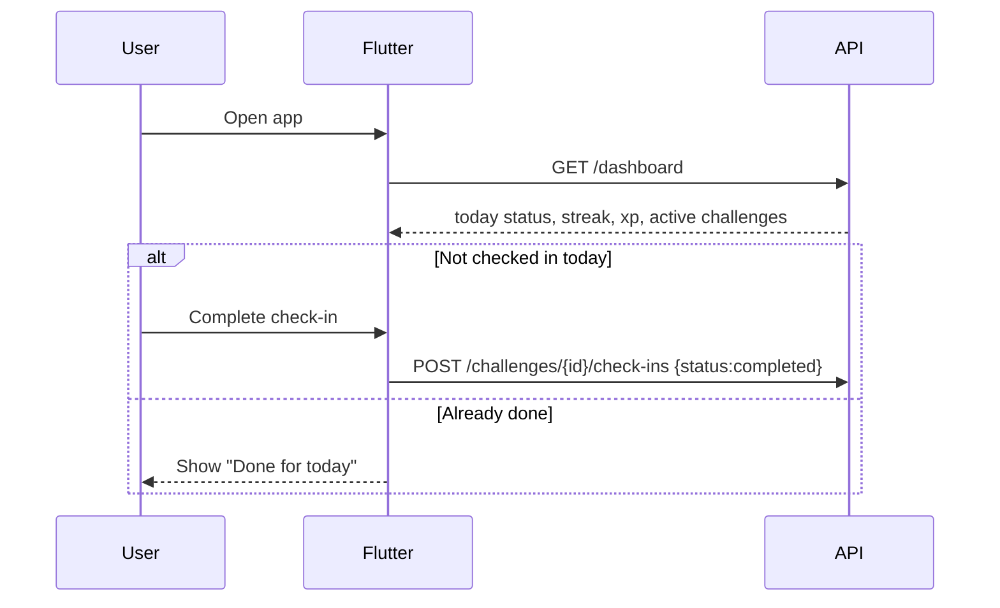
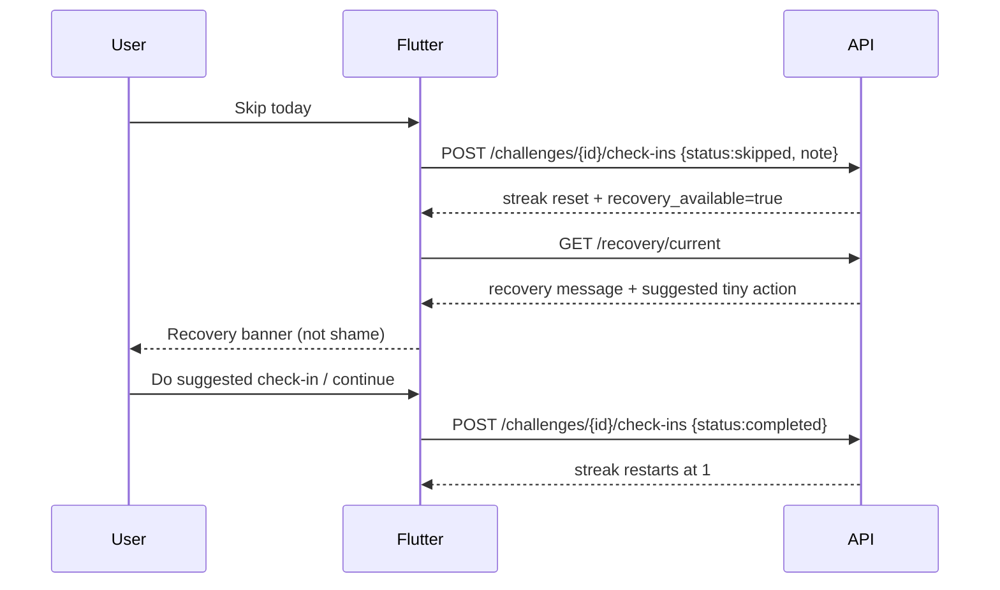
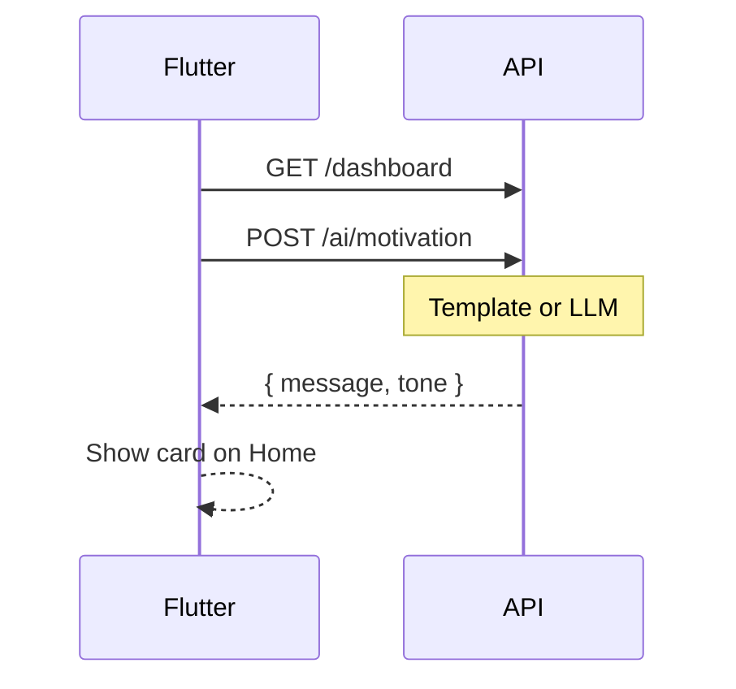

# 04 — User Flows (End-to-End)

## Flow A — First win (activation)

**Mobile screens:** Register → Create Challenge → Challenge Detail → Check-in sheet → Home

---

## Flow B — Daily return

---

## Flow C — Miss / skip → recovery (the differentiator)

**Copy rule (mobile + API message):**  
Never say “You failed.” Prefer “Missed day — let’s restart small.”

---

## Flow D — Motivation card (optional)

---

## Screen map (Flutter)

| Route (suggested) | Screen | APIs used |
|-------------------|--------|-----------|
| `/login` | Login | `POST /auth/login` |
| `/register` | Register | `POST /auth/register` |
| `/home` | Dashboard | `GET /dashboard`, `GET /recovery/current`, `POST /ai/motivation` |
| `/challenges` | List | `GET /challenges` |
| `/challenges/create` | Create | `POST /challenges` |
| `/challenges/:id` | Detail | `GET /challenges/{id}`, activate, check-ins |
| `/progress` | Progress | `GET /progress` (or dashboard only for MVP) |
| `/profile` | Profile | `GET /me`, `PATCH /me` |

---

## State rules mobile must respect

1. Only **one active check-in per challenge per date** (server enforces).  
2. If challenge not `active`, disable check-in button.  
3. After skip/miss, show recovery UI when `recovery.active == true`.  
4. Optimistic UI OK, but reload dashboard after check-in.  
5. Token stored securely; send on every authenticated call.
