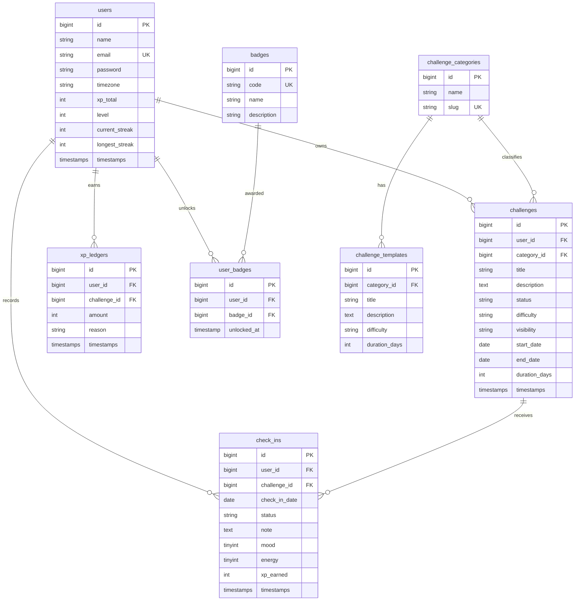

# 06 — Data Model (MVP)

Simple relational model for hackathon. IDs may be `bigint` or `uuid` — **pick one and stay consistent**. Recommendation: `bigint` autoincrement for speed.

---

## ERD



---

## Table specs (minimum columns)

### users
| Column | Type | Notes |
|--------|------|-------|
| id | bigint PK | |
| name | varchar(255) | |
| email | varchar(255) unique | |
| password | varchar(255) | hashed |
| timezone | varchar(64) nullable | default `UTC` |
| xp_total | int default 0 | |
| level | int default 1 | |
| current_streak | int default 0 | global or derive from challenges — MVP can keep on user |
| longest_streak | int default 0 | |
| created_at / updated_at | timestamps | |
| remember tokens / sanctum | via Sanctum tables | |

### challenges
| Column | Type | Notes |
|--------|------|-------|
| id | bigint PK | |
| user_id | FK users | index |
| category_id | FK nullable | |
| title | varchar(255) | |
| description | text nullable | |
| status | varchar(32) | enum values |
| difficulty | varchar(32) | |
| visibility | varchar(32) | default private |
| start_date | date nullable | set on activate |
| end_date | date nullable | |
| duration_days | int default 7 | |
| created_at / updated_at | timestamps | |
| deleted_at | soft delete optional | |

**Indexes:** `(user_id, status)`, `(user_id, created_at)`

### check_ins
| Column | Type | Notes |
|--------|------|-------|
| id | bigint PK | |
| user_id | FK | |
| challenge_id | FK | |
| check_in_date | date | |
| status | varchar(16) | completed/skipped/missed |
| note | text nullable | |
| mood | tinyint nullable | 1–5 |
| energy | tinyint nullable | 1–5 |
| xp_earned | int default 0 | |
| created_at / updated_at | timestamps | |

**Unique constraint (critical):** `(challenge_id, check_in_date)`

### xp_ledgers
| Column | Type | Notes |
|--------|------|-------|
| id | bigint PK | |
| user_id | FK | |
| challenge_id | FK nullable | |
| amount | int | |
| reason | varchar(64) | check_in_completed, streak_bonus, daily_reward |
| created_at | timestamp | |

### badges / user_badges
Seed 3–4 badges. Unlock in service when events happen.

### challenge_categories / challenge_templates
Optional for demo speed; seed 2 categories + 3 templates.

---

## Derived fields (do not always store)

Compute on read for MVP if easier:

- `progress_percent` = completed_checkins / duration_days * 100  
- `checked_in_today` = exists check_in for today  
- `recovery.active` = rule in API contract §5  

Optional cache on `challenges`: `current_streak`, `longest_streak`, `completed_checkins` for faster dashboard.

---

## AI / RAG tables (MVP-MUST)

| Table | Purpose |
|-------|---------|
| `knowledge_articles` | Filament-managed coaching/FAQ content |
| `knowledge_chunks` | Retrieved text for simple RAG |
| `chat_sessions` | Per-user chatbot threads |
| `chat_messages` | user/assistant messages |

See [09-simple-ai-rag-chat.md](./09-simple-ai-rag-chat.md) and Backend team guide for columns.

---

## Seed data for demo

```text
User: demo@liora.change / password
Admin: admin@liora.change / password
Categories: Health, Focus, Wellbeing
Templates:
  - 7-Day Morning Walk (beginner, 7)
  - No Sugar Week (medium, 7)
  - Night Phone Curfew (easy, 7)
Badges: first_checkin, streak_3, comeback
Knowledge: Recovery basics, Tiny habits, Humane streaks, Check-in FAQ
```

---

## Mobile field guide (what to display)

| UI element | Field(s) |
|------------|----------|
| Home greeting | `dashboard.user.name` |
| Streak flame | `dashboard.user.current_streak` |
| XP / level | `xp_total`, `level` |
| Today list | `active_challenges[]` + `checked_in_today` |
| Recovery card | `dashboard.recovery` or `/recovery/current` |
| Challenge detail progress | `progress_percent` |
| Check-in result toast | `summary.xp_earned`, `summary.current_streak` |
