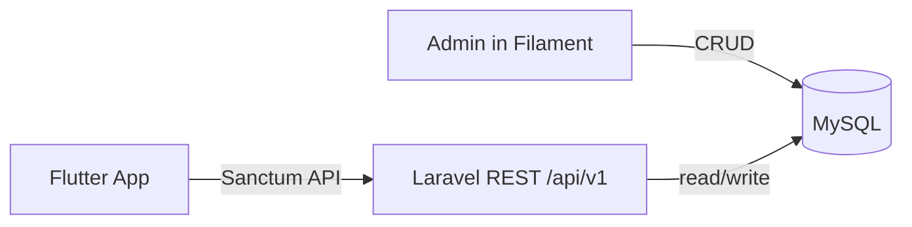

# 08 — Filament Admin (MVP)

**Yes — the backend includes Filament.**  
Mobile talks to the REST API. **Admins operate the product in Filament.**  
Both are part of the hackathon platform story.

---

## Why Filament is in the MVP

Judges should see:

1. **Mobile** — member transforms behavior (challenge → check-in → recovery)  
2. **Filament** — operators manage content that powers the app (categories, templates, users)

That proves Liora Change is a **platform**, not only a mobile UI.

---

## Panel access

| Item | Value |
|------|-------|
| Panel ID | `liora_change` |
| URL path | `/liora_change` |
| Full local URL | `http://localhost:8000/liora_change` |
| Auth | Filament session login (admin user) |
| Stack | Filament v4 on Laravel 12 |

Mobile **does not** call Filament. Filament writes the same MySQL data the API reads.

---

## Resources already in the repo (use these)

| Filament Resource | Model | MVP role |
|-------------------|-------|----------|
| `UserResource` | User | View/manage members |
| `RoleResource` | Role | Roles / permissions |
| `ChallengeResource` | Challenge | Inspect user challenges |
| `ChallengeCategoryResource` | ChallengeCategory | Manage categories |
| `ChallengeTemplateResource` | ChallengeTemplate | Manage starter templates |
| `FeaturedChallengeResource` | FeaturedChallenge | Highlight challenges (nice) |
| KnowledgeArticleResource *(add)* | KnowledgeArticle | Simple RAG knowledge (MUST) |

---

## Hackathon MUST (Admin)

Backend team must ensure for demo:

- [ ] Admin can log into `/liora_change`  
- [ ] Seed at least one **admin** user  
- [ ] Categories CRUD works  
- [ ] Templates CRUD works  
- [ ] Users list works (see demo mobile users)  
- [ ] Templates created in Filament appear in API `GET /challenge-templates` (if that endpoint is shipped)

---

## Hackathon NICE (Admin)

- [ ] Challenges list (read-only or limited edit)  
- [ ] Featured challenges  
- [ ] Simple dashboard widgets (user count, active challenges)  
- [ ] Badge / reward management (only if time)

---

### Knowledge (MUST — powers simple RAG chatbot)

Add **KnowledgeArticleResource**:
- Fields: `title`, `body`, `category`, `is_active`
- On save: Backend re-chunks into `knowledge_chunks` for `/ai/chat`

Demo: edit “Recovery basics” → ask chatbot the same question → answer should reflect content.

---

## Out of Filament MVP (LATER)

| Cut from admin for hackathon |
|------------------------------|
| Prompt template versioning UI |
| Voice / AI provider settings |
| Full moderation case queue |
| Complex analytics BI |
| Qdrant / vector admin |

---

## Demo script addition (30–45 seconds)

After the mobile recovery story:

1. Open Filament `/liora_change`  
2. Show **Challenge Templates** → open “7-Day Morning Walk”  
3. Optionally edit title/description → save  
4. On mobile, pull templates / create from template (if wired) **or** explain:  
   > “Admins curate science-backed challenge templates; members consume them in the app.”

---

## Data flow (Admin ↔ API ↔ Mobile)

**Rule:** Filament and API share the same tables. No separate admin database.

---

## Seed accounts

| Email | Password | Role | Used for |
|-------|----------|------|----------|
| `admin@liora.change` | `password` | admin | Filament demo |
| `demo@liora.change` | `password` | member | Mobile demo |
| `mobile@liora.change` | `password` | member | Mobile QA |

---

## Ownership

| Task | Owner |
|------|-------|
| Filament panel works + seed admin | Backend |
| Categories / templates usable in admin | Backend |
| API exposes templates/categories to app | Backend |
| Mobile consumes templates (optional UI) | Mobile |
| Show Filament in pitch/demo | Either (usually Backend lead) |

---

## Communication rule

- Content changes (template title, category names) → done in **Filament**, not hardcoded in Flutter.  
- If mobile needs a new template field → update API contract + Filament form + DB together.
