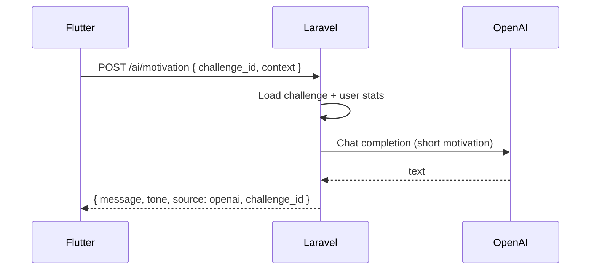
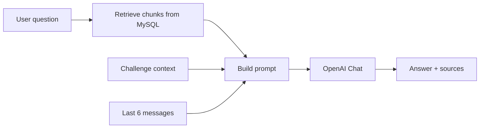

# 09 — Simple AI: Motivation + RAG Chatbot (MVP)

**Status:** MVP-MUST (keep it simple for hackathon)  
**Providers:** OpenAI (chat + optional embeddings)  
**Vector DB:** **Not required** — MySQL knowledge chunks + simple retrieval  

| Audience | Detail |
|----------|--------|
| Shared schemas | [teams/SHARED-DATA-CONTRACT.md](./teams/SHARED-DATA-CONTRACT.md) § AI |
| Backend how-to | [teams/BACKEND-TEAM-GUIDE.md](./teams/BACKEND-TEAM-GUIDE.md) § AI |
| Mobile how-to | [teams/MOBILE-TEAM-GUIDE.md](./teams/MOBILE-TEAM-GUIDE.md) § AI |
| HTTP examples | [05-api-contract.md](./05-api-contract.md) § AI |

---

## 1. What we build (simple)

| Feature | Purpose | Endpoint |
|---------|---------|----------|
| **AI Motivation** | Generate short encouragement from the user’s **active challenge** context | `POST /ai/motivation` |
| **AI Chatbot + simple RAG** | Answer coaching questions using small knowledge base + user challenge context | `POST /ai/chat` |

We are **not** building: voice, Qdrant, multi-agent systems, fine-tuning.

---

## 2. AI Motivation (challenge-based)

### Input signals (Backend builds prompt from DB)

| Signal | Source |
|--------|--------|
| User name | `users.name` |
| Challenge title | `challenges.title` |
| Challenge description | `challenges.description` |
| Difficulty | `challenges.difficulty` |
| Streak | `challenges.current_streak` or user streak |
| Progress % | computed |
| Last check-in status | latest check_in |
| Context | request: `morning` \| `recovery` \| `general` |

### Flow



### Fallback

If OpenAI fails / no API key → return **template** string still personalized with challenge title (`source: template`). Never crash the Home screen.

### Prompt rules (Backend)

- Max ~60 words  
- Encouraging, not clinical  
- Mention challenge title  
- If context=`recovery`, normalize setbacks  
- Prefer user’s language later; English OK for MVP  

---

## 3. Simple RAG Chatbot

### Idea (hackathon-simple)

1. Admin seeds / manages **knowledge articles** in Filament (or seeder)  
2. Each article is split into **chunks** (paragraphs) stored in MySQL  
3. On chat message:
   - Retrieve top 3–5 relevant chunks (keyword / LIKE / FULLTEXT — **or** optional embedding similarity)  
   - Build prompt: system + chunks + last messages + user question + challenge summary  
   - Call OpenAI chat  
   - Return assistant reply + optional `sources[]`  



### Why no Qdrant for MVP

Small knowledge base (10–30 chunks) works with MySQL FULLTEXT or keyword scoring. Upgrade to Qdrant later (architecture docs).

### Retrieval (pick one — Backend chooses)

| Method | Complexity | Good enough? |
|--------|------------|--------------|
| **A. Keyword / FULLTEXT** on `chunk_text` | Lowest | Yes for demo |
| **B. OpenAI embeddings** stored as JSON on chunk + cosine in PHP | Medium | Nicer demo |

**Recommendation for hackathon:** Method A first; Method B if time.

---

## 4. Knowledge content to seed

Seed 8–15 short chunks, for example:

- Habit formation basics (tiny habits)  
- What to do after a missed day  
- How streaks work in Liora (humane)  
- How to write a good challenge  
- Motivation vs discipline (short)  
- FAQ: how check-ins work  
- FAQ: what is recovery  

Filament: simple **Knowledge Article** resource (title, body, category, is_active).  
On save: Backend can re-chunk body into `knowledge_chunks`.

---

## 5. API surface (summary)

| Method | Path | Must |
|--------|------|------|
| POST | `/ai/motivation` | MUST |
| POST | `/ai/chat` | MUST |
| GET | `/ai/chat/sessions` | NICE |
| GET | `/ai/chat/sessions/{id}/messages` | NICE |

Full schemas: SHARED-DATA-CONTRACT + API contract § AI.

---

## 6. Mobile UX

| Screen | Behavior |
|--------|----------|
| Home | “Get motivation” button → `POST /ai/motivation` with current challenge id |
| Coach / Chat | Chat UI → `POST /ai/chat` with message + optional `challenge_id` + `session_id` |
| Recovery banner | Optional: request motivation with `context: recovery` |

Show loading state while AI responds. Show fallback text if `source == template`.

---

## 7. Filament

| Resource | MVP |
|----------|-----|
| KnowledgeArticleResource | MUST (title, body, is_active) |
| (auto chunks on save) | MUST logic in Backend |

Optional: view chunks read-only.

---

## 8. Env

```env
OPENAI_API_KEY=sk-...
OPENAI_MODEL=gpt-4o-mini
AI_MOTIVATION_ENABLED=true
AI_CHAT_ENABLED=true
```

If key missing → template / canned FAQ answers still work for demo.

---

## 9. Safety (keep light)

- System prompt: not a doctor/therapist; supportive coach only  
- Max message length 1000 chars  
- Rate limit: e.g. 20 AI calls / user / hour  
- Do not send other users’ data into prompts  
- Log AI calls for debugging (no need for full eval harness in hackathon)

---

## 10. Demo script (AI part)

1. Open Home → tap **Motivate me** → show text mentioning “Morning Walk”  
2. Open **Coach** chat → ask “What should I do if I miss a day?”  
3. Bot answers using recovery knowledge chunk  
4. Optional: show `sources` labels (“Recovery basics”)  

---

## 11. Acceptance

- [ ] Motivation uses real challenge fields in prompt  
- [ ] Motivation works with OpenAI; falls back to template  
- [ ] Chat returns useful answer grounded in seeded knowledge  
- [ ] Chat can use `challenge_id` for personalization  
- [ ] Filament can add/edit a knowledge article  
- [ ] Mobile Home + Chat screens wired  
- [ ] Same JSON schemas on both teams (SHARED contract)
